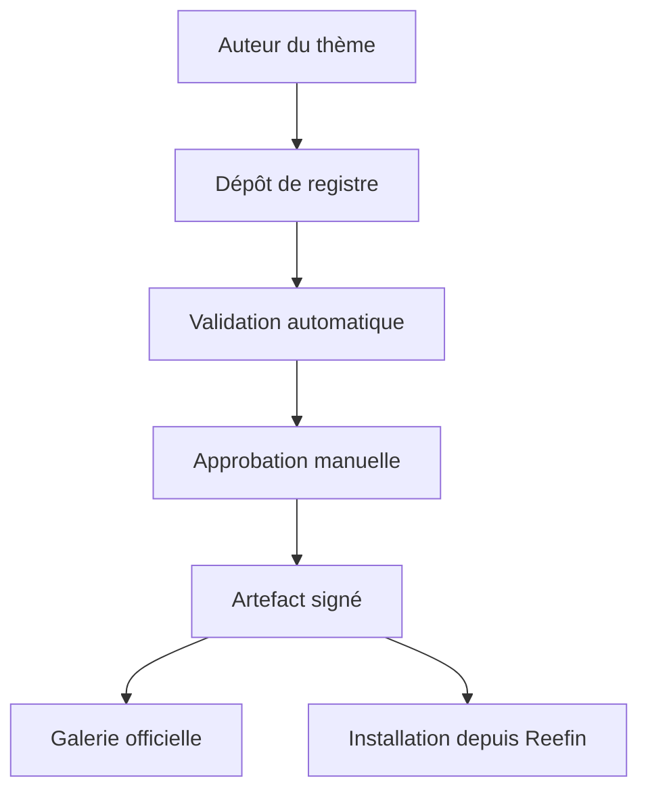

# RFC-0005 — Design system, thèmes et catalogue Reefin

- **Statut** : Draft
- **Date** : 2026-07-17
- **Auteur** : Reefin Team
- **Dépôt** : `reefin-web` (fork de `jellyfin-web`)
- **Relation** : RFC-0003 (`docs/reefin/RFC-0003-product-rupture.md`) §9.5 (mandat design system —
  tokens couleur, typographie/espacements, composants uniques, responsive réel, navigation
  télécommande/clavier, densité réglable, thèmes clair/sombre, animations limitées accessibles) et
  §12 (frontière plugins/Plugin SDK v2) ; RFC-0001 (`docs/reefin/RFC-0001-vision-and-feasibility.md`)
  pilier 1 (« Interface entièrement modernisée ») ; `design-reefin-shell-and-routing.md` §3.3 (états
  loading/error/empty) et §4 (checklist de migration route par route) ; RFC-0004
  (`docs/reefin/RFC-0004-platform-scope-and-legacy-tv-removal.md`) §4 (UX télévision générique —
  `KeyNames`, gamepad, `layoutManager.tv`, `:focus-visible` — à préserver dans les composants React
  du design system).

---

## 1. Contexte et motivation

RFC-0003 §9.5 mandate un « design system Reefin propre » sans document dédié, en le désignant
explicitement comme candidat naturel une fois le nouveau shell stabilisé (`design-reefin-shell-and-
routing.md`, mergé en W13.3, PR #4 ; première tranche `/home` en W13.4, PR #5). Ce moment est arrivé : `/home` est la première route entièrement
réécrite en composants React modernes (`src/apps/modern/routes/home.tsx`,
`features/home/components/*`), et elle expose déjà les symptômes que ce RFC doit corriger plutôt que
laisser se répéter route après route.

Deux systèmes empilés coexistent aujourd'hui sans jamais avoir été unifiés :

1. **Le système de thèmes hérité** (`src/themes/`) : six thèmes, deux couches faiblement couplées
   (palette MUI + CSS Sass legacy), un préfixe de custom properties `jf` hérité de Jellyfin, trois
   sources de vérité indépendantes pour le catalogue de thèmes (`src/config.json`, `src/themes/
   index.ts`, les dossiers `src/themes/<id>/`). Détaillé en §3.1.
2. **L'absence de kit de composants** : `src/ui/` n'existe pas. La route `/home` réécrite consomme
   directement MUI (`Box`, `Tab`, `Tabs`, `Alert`, `Skeleton`…), des classes CSS historiques
   (`sectionTitleContainer-cards`, `verticalSection`, `mainAnimatedPage homePage libraryPage`) et un
   pont de types (`itemDtoAdapter.ts`) vers l'ancien `cardBuilder`. Détaillé en §3.2.

Sans ce RFC, chaque route migrée (`/library/:libraryId` en W13.7, `/title/:itemId` en W13.9, cf. §10)
réinventerait sa propre variante de carte média, d'onglets, d'état vide — exactement le problème que
le pilier 1 de RFC-0001 identifie comme « recoloration » plutôt que refonte réelle. Ce document fige
les décisions produit nécessaires pour que la suite de la migration du shell (§4 du design doc)
s'appuie sur un socle commun : quatre concepts distincts (§4), un design system `src/ui/` (§5), un
contrat de thème formel (§6), trois thèmes intégrés (§7), une stratégie de chargement/budget/
persistance (§8), et un catalogue communautaire (§9).

---

## 2. Périmètre

**Dans le périmètre de ce RFC** :
- La séparation conceptuelle design system / thème / préréglage de disposition / plugin (§4).
- L'architecture du futur `src/ui/` : liste de composants, contrat de variantes sémantiques, slots
  publics (§5).
- Le contrat de thème (`ThemeDefinition`, format de paquet communautaire v1) et la migration du
  préfixe `jf` vers `--rf-*` (§6).
- Les trois thèmes intégrés Reefin Classic / Reefin Glass / Reefin Cinema, et le sort des six thèmes
  hérités (§7).
- La stratégie de chargement par chunk, les budgets, et la persistance de la sélection utilisateur
  (§8).
- Le modèle du catalogue officiel de thèmes communautaires — pipeline de validation, sans backend de
  téléversement en v1 (§9).
- Le séquencement en tranches W13.5 → W14.0+ (§10).

**Hors périmètre (explicitement différé, non traité ici)** :
- L'implémentation elle-même : ce RFC ne produit aucun code. La tranche W13.5 est ce document ; le
  premier code arrive en W13.6 (§10).
- Le Plugin SDK v2 (RFC-0003 §12) : les thèmes et les plugins partageront à terme la même galerie
  (§9.5) mais restent deux pipelines de sécurité distincts ; ce RFC ne spécifie pas le sandbox plugin.
- La refonte du lecteur (machine à états, RFC-0003 §9.3) et la configuration guidée matérielle
  (RFC-0003 §9.4) : hors sujet design system, sauf pour les composants `PlayerControls` listés en §5
  qui n'en spécifient que l'habillage, pas la logique.
- La synchronisation serveur du choix de thème (`DisplayPreferences`) : tranchée en v1 comme
  local-only, rouverte en question ouverte (§11.1).

---

## 3. État des lieux — audit

### 3.1 Système de thèmes hérité (`src/themes/`)

Architecture actuelle :

```
src/themes/
├── index.ts                 # createTheme() MUI, assemble les 6 colorSchemes
├── themeStorageManager.ts   # StorageManager MUI custom (no-op, piloté par events)
├── utils.ts                 # buildCustomColorScheme() — merge avec les défauts MUI
├── _base/
│   ├── theme.ts             # DEFAULT_COLOR_SCHEME (TS) + DEFAULT_THEME_OPTIONS
│   ├── _palette.scss        # variables SCSS des couleurs par défaut (dupliqué de theme.ts)
│   └── _theme.scss          # 558 lignes CSS legacy (.emby-*, .cardBox, #comicsPlayer…)
├── appletv/      149 lignes scss, @use base
├── blueradiance/ 51 lignes + bg.jpg 52K, @use base
├── dark/         32 lignes, @use base (défaut)
├── light/        74 lignes, @use base
├── purplehaze/   657 lignes + bg.jpg 24K, PAS de @use base (hardcodé intégral)
└── wmc/          52 lignes, @use base
```

Deux systèmes empilés, faiblement couplés :
- **Palette MUI** (`*/index.ts`) : `ColorSystemOptions` fusionnés via `buildCustomColorScheme`
  (`src/themes/utils.ts:16`), défauts dans `src/themes/_base/theme.ts:7`.
- **CSS legacy** (`*/theme.scss`) : feuilles Sass compilées séparément, consommées par les vues
  jQuery/legacy, lisant les custom properties `--jf-palette-*` posées par MUI
  (`cssVariables.cssVarPrefix: 'jf'`, `src/themes/index.ts:14`), avec fallback SCSS
  `var(--jf-x, $scss-fallback)`.

Comparatif des six thèmes hérités :

| Thème | Mode | Palette | Structure/layout propre |
| --- | --- | --- | --- |
| dark | dark | défaut | aucune (32 lignes = `@use` + 1 override `.detailRibbon`) |
| light | light | fond clair | aucune |
| appletv | light | fond bleuté, dégradés | OUI : `$header-gradient` sur header/footer/ribbon, `border-radius` custom (0,5rem cartes), cartes translucides `rgba()` |
| blueradiance | dark | bleu marine + `bg.jpg` 52K | dégradé `.detailRibbon` |
| purplehaze | dark | violet/cyan + `bg.jpg` 24K | OUI : 657 lignes hardcodées indépendantes de `_base` — `border-radius` 0,4em/0,8em (vs 0,2em base), dégradés multi-stops, sélecteurs `#btnDeleteImage`, `div[data-role="controlgroup"]` |
| wmc | dark | bleu WMC + dégradé | aucune |

Seuls `appletv` et `purplehaze` divergent structurellement. Les quatre autres sont des variations de
palette avec éventuelle image de fond. `purplehaze` est un thème « orphelin » jamais migré vers
`_base`, avec environ deux fois plus de code que tous les autres réunis — c'est cette asymétrie qui
motive la décision §7.1 de n'en faire ni un des trois thèmes structurels, ni un préréglage trivial.

**Préfixe `jf`** : défini une seule fois (`src/themes/index.ts:14`, avec
`colorSchemeSelector: '[data-theme="%s"]'`, `disableCssColorScheme: true`), consommé exclusivement
comme préfixe de custom properties MUI (`--jf-palette-*`, `--jf-card-borderRadius`…), jamais comme
nom de classe. **107 occurrences dans 5 fichiers** : `src/themes/_base/_theme.scss` (~95),
`appletv/theme.scss`, `light/theme.scss`, `dark/theme.scss`, et un seul hors thèmes :
`src/plugins/bookPlayer/BookOsd/BookOsd.scss:16`.

**Chargement runtime et persistance** :
- Deux consommateurs de `appTheme` : `src/RootAppRouter.tsx:22,57-61` (`ThemeProvider` +
  `ThemeStorageManager`, `defaultMode` dark) et `src/utils/reactUtils.tsx:64-70` (montage React dans
  vues legacy, `storageManager=null`).
- `src/themes/themeStorageManager.ts:13-24` : `StorageManager` no-op ; pilotage réel via bus
  d'événements (`EventType.THEME_CHANGE` sur `document`).
- `src/hooks/useUserTheme.ts` : `theme = userSettings.theme() || defaultTheme?.id || 'dark'` ;
  `src/utils/reactUtils.tsx:43-49` appelle `setColorScheme(theme)`. Changement MUI **synchrone** en
  mémoire — pas de chargement JS différé pour la palette.
- CSS legacy **déjà différé** : `src/components/ThemeCss.tsx:10,23` injecte
  `<link href="themes/${id}/theme.css">` ; webpack (`webpack.common.js:34-40,109-117`) crée un entry
  par thème (fast-glob `themes/**/*.scss`) + `MiniCssExtractPlugin` vers `[name]/theme.css`. Seul le
  thème actif est téléchargé — pattern à conserver tel quel (§8.1).
- Persistance **localStorage uniquement**, jamais serveur : `src/scripts/settings/userSettings.js:
  484-490` (`enableOnServer: false`), repli `appSettings` (`src/scripts/settings/appSettings.js:
  273-283`, clé préfixée par `userId`). Contrairement à d'autres préférences poussées via
  `updateDisplayPreferences`, le thème n'est jamais synchronisé serveur — pas de partage entre
  appareils (§8.3, §11.1).
- Catalogue des thèmes proposés : `src/config.json:4-31` (liste `{name,id,color,default}`) via
  `getThemes()`/`getDefaultTheme()` (`src/scripts/settings/webSettings.js:84-103`) et
  `src/hooks/useThemes.ts`. **Troisième source de vérité**, indépendante des dossiers et de
  `colorSchemes`, sans synchronisation garantie (§6.4).

**Impact bundle** : les 6 `colorSchemes` MUI (`src/themes/index.ts:20-27`) sont importés de façon
**synchrone** dans des fichiers cœur (`RootAppRouter.tsx:22`, `reactUtils.tsx:15`) — toujours présents
dans `main.jellyfin.bundle.js`. Poids faible mais couplage structurel qui empêche tout découpage par
thème côté JS, alors que le CSS l'est déjà (§8.1). Budget actuel :
`webpack.performance-budget.json:2-4` fixe 460 800 octets (450 KiB) sur `main.jellyfin.bundle.js`,
appliqué par `webpack.prod.js:15-27`, revérifié par `scripts/verify-bundle-budget.mjs`. Dernière
mesure connue (RFC-0004 §7.5.5) : 384 761 octets (375,7 KiB) ; le plan produit cite ~417 KiB comme
état courant approximatif — les deux chiffres restent sous le budget, avec une marge de l'ordre de
35 à 76 KiB selon la mesure retenue.

### 3.2 Surface `/home` et shell modern

`src/apps/modern/routes/home.tsx` illustre exactement l'absence de design system :
- L1 : `import { BaseItemKind } from '@jellyfin/sdk/lib/generated-client/models/base-item-kind'` —
  import direct `@jellyfin/sdk` alors que le reste de `features/home/*` consomme `lib/reefin-sdk`.
  Incohérence à corriger en W13.6 (§10).
- L2-4 : MUI direct (`Box`, `Tab`, `Tabs`) sans wrapper de design system.
- L8-10 : dépendances legacy (`components/backdrop/backdrop`, `components/Page`, `lib/globalize`).
- L37-44 : manipulation DOM impérative (`document.querySelector('.skinHeader')`) et classe
  `noHomeButtonHeader`.
- L54 : classes historiques `'mainAnimatedPage homePage libraryPage allLibraryPage'`.

`features/home/components/HomeSection.tsx` est aujourd'hui le seul point de mutualisation UI du
slice (états loading/error/empty/success conformes à `design-reefin-shell-and-routing.md` §3.3), mais
il le fait avec MUI direct et des classes historiques en dur (`sectionTitleContainer-cards`,
`verticalSection`) — exactement le rôle que `LoadingState`/`EmptyState`/`ErrorState` et `MediaShelf`
doivent reprendre (§5). `features/home/utils/itemDtoAdapter.ts:4-18` illustre le coût de l'absence de
contrat commun : un cast `item as unknown as ItemDto` sert de pont entre `BaseItemDto` (reefin-sdk) et
le type legacy `ItemDto`, requis parce que `SectionContainer`/`Cards`/`cardOptions` attendent encore
le type historique.

Côté shell, `AppLayout.tsx` (MUI direct) s'appuie sur des primitives partagées disparates, toutes sous
`src/components/` (pas de `src/ui/`) : `AppBody`, `CustomCss`, `OffsetAppBar`, `ThemeCss`.
`AppBody.tsx:19-20` rend encore `<div className='mainAnimatedPages skinBody'>` — pont direct avec le
`viewContainer` legacy. `AppOverrides.scss` (41 lignes) redéclare en dur les breakpoints MUI (L1-6)
sans pont SCSS↔MUI (question ouverte §11.6).

`src/ui/` **n'existe pas**. Le plus proche d'un embryon de kit UI est `src/components/common/`
(`SectionContainer`, `Image`, `NoItemsMessage`, `PlayArrowIconButton`…), mais il reste couplé aux
classes CSS historiques et aux Web Components `src/elements/emby-*`.

---

## 4. Séparation de quatre concepts

Le point de départ produit de ce RFC est de ne plus confondre quatre notions aujourd'hui mélangées
dans `src/themes/` et dans les demandes communautaires de type Abyss :

| Concept | Rôle |
| --- | --- |
| **Design system** | Composants et comportements stables fournis par Reefin (`src/ui/`, §5) — structure, accessibilité, API. |
| **Thème** | Couleurs, typographie, rayons, surfaces, ombres, flou, mouvement — un jeu de valeurs de tokens (§6). |
| **Préréglage de disposition** (*layout preset*) | Densité, présence d'un hero, taille des cartes, agencement de la navigation — un jeu de choix de composition, pas de couleur. |
| **Plugin** | Fonctionnalité exécutable, modèle de sécurité distinct (sandbox, Plugin SDK v2, RFC-0003 §12) — hors périmètre thème. |

Exemple canonique retenu pour trancher les cas ambigus : **le bandeau Spotlight du thème
communautaire Abyss est une fonctionnalité de préréglage de page, pas une couleur de thème.** Un
thème ne doit jamais avoir besoin de JavaScript ou de logique de sélection de contenu pour exister —
c'est précisément ce que le format de paquet déclaratif du §6.2 interdit, et ce que le préréglage de
disposition (composition de `HeroSpotlight`, densité, choix de shelf) doit porter à sa place. Cette
distinction est ce qui permet au §7.2 de réimplémenter « l'esprit Abyss » comme thème Glass sans
importer son couplage JS/CSS.

---

## 5. Design system `src/ui/`

`src/ui/` est introduit progressivement à partir de W13.6 (§10), candidat naturel à devenir à terme un
package séparé `@reefin/ui` une fois stabilisé — décision de packaging différée, pas prise ici.
Composants prévus, par famille :

| Famille | Composants |
| --- | --- |
| Structure | `AppShell`, `NavigationDrawer`, `PageHeader` |
| Surfaces | `Surface`, `GlassSurface`, `Dialog`, `Toast` |
| Interaction | `Tabs`, `Button`, `FormField`, `FocusRing` |
| Média | `MediaCard`, `MediaShelf`, `MediaGrid`, `MediaProgress` |
| Mise en avant | `HeroSpotlight`, `MetadataPills` |
| États | `LoadingState`, `EmptyState`, `ErrorState` |
| Lecture | `PlayerControls` |

**Contrat d'API** : chaque composant expose des variantes sémantiques (`surface="glass"`,
`density="comfortable"`, `cardStyle="poster"`) mais **jamais** ses classes MUI internes — c'est ce qui
manque aujourd'hui à `HomeSection.tsx` (§3.2), qui expose des classes historiques directement. Les
points de personnalisation publics passent par des attributs `data-rf-slot`, seule surface que le CSS
d'un thème communautaire est autorisé à cibler (§6.2) ; cibler autre chose (une classe MUI générée,
un id interne) est explicitement hors contrat et non garanti stable d'une version à l'autre.

**Tokens** : les composants consomment des custom properties `--rf-*`, qui remplacent progressivement
le préfixe `jf` hérité (§3.1 : 107 occurrences, 5 fichiers, `cssVarPrefix` défini
`src/themes/index.ts:14`). Le remplacement se fait fichier par fichier au fil de la migration de
chaque route (§10, W13.6), pas en un renommage global — le risque documenté est qu'un oubli de
`var(--jf-x, $fallback)` ne casse aucun build (pas d'erreur TypeScript/webpack) mais produit une
couleur silencieusement incorrecte (§3.1, cf. aussi risque 7 de l'audit thèmes).

**Accessibilité et navigation clavier/télécommande** : RFC-0004 §4 a explicitement préservé un socle
générique de navigation (`KeyNames`, `canEnableGamepad()`, `gamepadtokey.js`, `layoutManager.tv`,
styles `:focus-visible` des composants `emby-*`) et `design-reefin-shell-and-routing.md` §3.4 exige
que ce socle continue de fonctionner identiquement dans les composants React du shell moderne.
`FocusRing` est le point d'intégration explicite de cette exigence dans `src/ui/` : il porte la
gestion du focus visible pour tous les composants interactifs du design system (`Button`, `Tabs`,
`MediaCard`), consomme le même socle générique plutôt que d'en réinventer un, et doit rester
opérationnel que le layout actif soit desktop, mobile ou 10-foot. Les animations des composants
respectent `prefers-reduced-motion` par défaut (repris en détail pour les thèmes en §7.2 et §7.3).

---

## 6. Contrat de thème

### 6.1 Interface `ThemeDefinition`

Un thème est défini par une interface `ThemeDefinition` qui sépare strictement trois éléments :
identité (nom, auteur, licence, version, plage de compatibilité), tokens (valeurs de couleur,
typographie, formes, mouvement, densité), et un CSS optionnel strictement scoped aux slots publics
`data-rf-slot` exposés par `src/ui/` (§5). Cette interface est ce qui remplace, côté runtime, les deux
couches aujourd'hui faiblement couplées de `src/themes/` (palette MUI d'un côté, CSS Sass legacy de
l'autre, §3.1) par une source unique consommée à la fois par le rendu MUI et par le CSS exporté.

### 6.2 Format de paquet communautaire v1 — strictement déclaratif

| Fichier | Contenu |
| --- | --- |
| `theme.json` | Identité : nom, id, version, auteur, licence SPDX, plage de compatibilité Reefin. |
| `tokens.json` | Couleurs, typographie, formes, mouvement, densité. |
| CSS optionnel | Limité aux slots publics `data-rf-slot` — aucun sélecteur interne. |
| Polices / images | Fichiers locaux uniquement, embarqués dans le paquet. |

**Interdits explicites**, directement dérivés des anti-patterns observés dans le CSS legacy actuel et
dans l'écosystème communautaire Jellyfin :
- Tout JavaScript exécutable dans un paquet de thème.
- Les sélecteurs internes (`#indexPage`, tout id d'implémentation, toute classe MUI générée).
- Les imports/ressources distantes (`@import url(...)`, polices ou images chargées hors du paquet).

Ces interdits ne sont pas théoriques : `_base/_theme.scss` contient déjà des sélecteurs d'id legacy
(`#comicsPlayer`, `#bookPlayer`, `#pdfPlayer`, `_base/_theme.scss:529-548`) et `purplehaze/theme.scss`
en ajoute d'autres qui lui sont propres (`#btnDeleteImage`, `#btnResetPassword`, `#btnRestart`,
`#btnShutdown`, L117-165) — exactement le type de couplage qu'un paquet de thème communautaire ne doit
plus jamais pouvoir reproduire, quel que soit son niveau de licence produit dans le catalogue (§9).

### 6.3 Trois sources de vérité à converger

L'audit (§3.1) identifie trois sources de vérité aujourd'hui indépendantes pour le catalogue de
thèmes : `src/config.json` (liste `{name,id,color,default}`), `src/themes/index.ts` (`colorSchemes`
MUI), et les dossiers `src/themes/<id>/` (CSS Sass). Ce RFC tranche : elles convergent vers **un
registre unique de thèmes**, construit à partir des `ThemeDefinition` (§6.1) — deux des trois sources
actuelles (a minima `config.json` et les `colorSchemes` MUI) sont générées ou dérivées depuis ce
registre plutôt que maintenues en parallèle. Le détail mécanique (génération à la build vs. au
runtime) est un choix d'implémentation laissé à W13.6 (§10), pas figé ici.

### 6.4 Abyss — inspiration assumée, pas dépendance

Le thème communautaire Abyss (`https://github.com/AumGupta/abyss-jellyfin`, licence MIT) est la
référence visuelle explicite du thème Reefin Glass (§7.2), et son analyse illustre concrètement
pourquoi le format déclaratif du §6.2 existe : `abyss.css` — environ 2 315 lignes, 261 déclarations
`!important`, 129 sélecteurs d'id — est un anti-modèle documenté de ce qu'un thème doit devenir dans
Reefin. Ce chiffrage caractérise le thème communautaire tel qu'il existe en amont sur GitHub ; aucun
de ces fichiers n'est présent dans `reefin-web`. Le principe retenu (§7.2) : reprendre le **langage
visuel** d'Abyss (verre dépoli, surfaces superposées, sidebar flottante, onglets pills), pas sa
**méthode** d'implémentation. Si une reprise substantielle de code source venait à être nécessaire, la
notice MIT doit être conservée intégralement ; la réimplémentation native via les composants `src/ui/`
reste toutefois l'option préférée dans tous les cas, précisément parce qu'elle produit un thème
conforme au format §6.2 alors qu'une reprise directe du CSS original ne le serait pas.

---

## 7. Trois thèmes intégrés

Le mode « contraste élevé » **n'est pas un quatrième thème** : c'est une option d'accessibilité,
applicable transversalement aux trois thèmes ci-dessous plutôt qu'un jeu de tokens séparé à maintenir.

### 7.1 Reefin Classic (thème par défaut)

Structure familière Jellyfin (aucune rupture de repères pour les utilisateurs existants), palette et
branding Reefin, contraste/espacements/focus améliorés par rapport à l'existant, modes clair et
sombre, animations discrètes, zéro dépendance au CSS historique à terme. `light` et `dark` sont
absorbés par les deux modes de Classic. Les thèmes hérités restants deviennent de **simples
préréglages de couleur compatibles Classic** — pas six thèmes structurels à maintenir indéfiniment :
directement pour `blueradiance` et `wmc` (pures variations de palette, §3.1), et par réduction
assumée pour `appletv`, dont les divergences structurelles (dégradés, `border-radius` custom, §3.1)
ne sont pas reconduites telles quelles — seules ses valeurs de palette migrent vers un `tokens.json`
Classic alternatif, le reste étant réévalué composant par composant au fil de la migration.

`purplehaze` est un cas à part, explicitement pas traité comme les trois autres : ses 657 lignes
hardcodées et son absence de `@use base` en font une dette isolée (§3.1, §11.2) plutôt qu'un simple
préréglage de couleur — sa réécriture ou son abandon est une question ouverte (§11.2), pas une
décision prise par ce RFC.

### 7.2 Reefin Glass

Réimplémentation native de l'esprit du thème communautaire Abyss (§6.4) : verre dépoli
(`backdrop-filter`), surfaces superposées, sidebar flottante, onglets en forme de pills, typographie
raffinée, animations douces respectant systématiquement `prefers-reduced-motion`. **Fallback opaque
obligatoire** pour les navigateurs/appareils sans support de `backdrop-filter` — Glass ne doit jamais
dégrader silencieusement en surface transparente illisible. Livré en W13.8 (§10), avec captures
Playwright dédiées desktop/mobile/TV.

### 7.3 Reefin Cinema

Esthétique cinématographique immersive : charbon profond, indigo, accents ambrés. Backdrops mis en
valeur (grandes images de fond d'item), surfaces **opaques** — performant sans dépendre de
`backdrop-filter`, à l'inverse de Glass. Typographie éditoriale, chrome (barres, contrôles) discret.
Livré en W13.9 (§10), en même temps que `HeroSpotlight` et les pastilles de métadonnées dont il est le
terrain d'expression naturel.

---

## 8. Chargement, budget et persistance

### 8.1 Chargement par chunk

Chaque thème constitue un chunk chargé à la demande. Le CSS de thème est **déjà** différé
aujourd'hui : `ThemeCss.tsx:10,23` injecte un `<link>` par thème actif, et webpack génère un entry par
thème via fast-glob (`webpack.common.js:34-40,109-117`) — ce pattern est conservé tel quel, pas
réinventé (§3.1). Ce qui doit changer : les 6 `colorSchemes` MUI, aujourd'hui importés de façon
synchrone dans `RootAppRouter.tsx:22` et `reactUtils.tsx:15`, doivent être découplés du bundle
principal et enregistrés dynamiquement au moment de la sélection du thème (piste : enregistrement
différé via l'API `extendTheme`/`useColorScheme` de MUI — à valider techniquement en W13.6, non
tranché ici).

### 8.2 Budgets

| Cible | Budget | Source |
| --- | --- | --- |
| `main.jellyfin.bundle.js` (bundle principal) | 450 KiB (460 800 octets) | `webpack.performance-budget.json:2-4`, appliqué `webpack.prod.js:15-27` ; dernière mesure connue 375,7 KiB (RFC-0004 §7.5.5), ~417 KiB cité comme état courant approximatif — marge restante dans les deux cas |
| Par thème (tokens + CSS), hors polices/images | **≤ 50 KiB** | Proposition de ce RFC — voir justification ci-dessous |

Justification du budget par thème : le CSS de thème le plus lourd aujourd'hui hors assets raster est
`purplehaze/theme.scss` à 657 lignes, de l'ordre de quelques dizaines de KiB non minifié ; un thème
`_base`-compatible comme `appletv` (149 lignes) ou `wmc` (52 lignes) est très en dessous. 50 KiB laisse
une marge confortable au-dessus du plus lourd cas legacy tout en excluant explicitement les assets
raster (`bg.jpg` 52K pour `blueradiance`, 24K pour `purplehaze`) — ceux-ci restent hors du budget CSS
critique, chargés séparément si le thème les utilise (§3.1, risque 9 de l'audit). Ce chiffre est une
proposition de départ à vérifier par mesure réelle une fois Classic livré (W13.6) ; il n'est pas
gravé.

**`verify:bundle-budget` n'est pas en CI** : `.github/workflows/__quality_checks.yml:36-40` ne lance
que lint/stylelint/`build:check`(=typecheck)/test — le quota GitHub Actions du dépôt est épuisé
(gates 100 % locales, précédent documenté en RFC-0004 §7.4). La vérification de budget reste **locale uniquement**, via
`npm run verify:bundle-budget` et l'agrégat `npm run validate:full`
(`package.json:148`) — c'est la gate à exécuter avant toute PR de ce RFC qui touche au bundle (§10).

### 8.3 Persistance

Décision de ce RFC : **la sélection de thème par utilisateur reste persistée en localStorage
uniquement en v1**, comme aujourd'hui (`userSettings.js:484-490`, `enableOnServer: false`) — pas de
synchronisation serveur (`DisplayPreferences`) dans le périmètre W13.5-W14.0. La synchronisation
multi-appareils reste une question ouverte (§11.1), pas une régression : le comportement actuel
(aucun partage entre appareils) est simplement maintenu, pas dégradé. Ce qui change : le catalogue de
thèmes disponibles pour la sélection provient du registre unique (§6.3) plutôt que de
`src/config.json` isolément.

---

## 9. Catalogue officiel (marketplace v1 sans backend)

### 9.1 Principe

Le catalogue officiel de thèmes communautaires est un **registre déclaratif**, pas une marketplace
avec backend de téléversement en v1 : un dépôt Git de manifestes approuvés, une validation
automatique, une approbation manuelle où le mainteneur reste le dernier gate, un artefact signé une
fois approuvé, publié à la fois dans une galerie statique officielle et installable directement depuis
Reefin.



Les versions publiées sont **immuables** : un identifiant + version donné ne change jamais de
contenu une fois publié. La **révocation** reste possible (retrait d'une version compromise ou non
conforme) sans réécriture rétroactive de l'historique du registre.

### 9.2 Validation automatique

| Critère | Détail |
| --- | --- |
| Schéma + identifiant unique | `theme.json`/`tokens.json` conformes au schéma publié (`theme.schema.json`, §10 W14.0), id de thème non collisionnant dans le registre |
| Licence | SPDX obligatoire dans `theme.json` |
| Compatibilité | Plage de versions Reefin explicite (pas de « toutes versions » implicite) |
| Sécurité | Aucun code exécutable, aucune ressource distante (§6.2) |
| Poids | Respect du budget par thème (§8.2) |
| Accessibilité | Contraste conforme, tests `axe` automatisés |
| Visuel | Captures Playwright desktop/mobile/TV générées automatiquement |
| Mouvement/transparence | Respect de `prefers-reduced-motion` et du mode sans transparence (fallback opaque, §7.2) |
| Couverture | Rendu vérifié sur une page de référence contenant tous les composants `src/ui/` (« Theme Lab », §10 W14.0) |
| Intégrité | Checksum + signature de l'artefact publié |

### 9.3 Approbation manuelle

La validation automatique (§9.2) est une condition nécessaire, pas suffisante : un mainteneur humain
reste le dernier gate avant publication dans la galerie officielle. Ce n'est pas redondant avec la
validation automatique — celle-ci ne peut pas juger de la qualité visuelle d'ensemble, de la
cohérence de marque, ou d'un contournement du format déclaratif qui passerait le schéma sans en violer
la lettre.

### 9.4 URL du catalogue — configurable, jamais figée en dur

Le nom de domaine définitif du site catalogue n'est pas tranché (conflit de nom/marque non résolu,
question ouverte §11.5). **L'URL du registre/catalogue doit être configurable** dans Reefin, jamais
codée en dur comme `reefin.com` dans le format de thème ou dans le client — le format de paquet
(§6.2) et le protocole de résolution de registre ne doivent dépendre d'aucun domaine particulier. Une
installation Reefin auto-hébergée doit pouvoir pointer vers un registre alternatif sans que cela
suppose une modification du format de thème lui-même.

### 9.5 Cohabitation future avec les plugins

Les plugins (RFC-0003 §12) pourront apparaître dans la même galerie que les thèmes, mais leur
installation ne sera possible qu'après l'existence du Plugin SDK v2 isolé (sandbox, hors-process,
RFC-0003 §6/§12). Ce sont **deux pipelines de sécurité distincts** dans une interface commune : les
thèmes sont déclaratifs et validés statiquement (§9.2), les plugins sont exécutables et nécessitent un
isolement runtime que ce RFC ne spécifie pas. La galerie unifiée est un objectif d'expérience
utilisateur (recherche unique, présentation commune), pas une fusion des modèles de sécurité.

---

## 10. Roadmap en tranches

### W13.5 — ce RFC

Rédaction et acceptation de ce document. **Aucun code produit avant acceptation.**

- Critères de vérification :
  - Document revu et statut passé à Accepted par le mainteneur.
  - Aucune modification de `src/` dans cette tranche.

### W13.6 — socle `src/ui/` et thème Classic

- `src/ui/` créé avec les premiers composants de §5 nécessaires à `/home` (`MediaShelf`, `MediaCard`,
  `Tabs`, `LoadingState`/`EmptyState`/`ErrorState`).
- Tokens `--rf-*` introduits, remplacement progressif du préfixe `jf` démarré (§3.1, §5).
- Registre unique de thèmes (§6.3) et chargement asynchrone par chunk pour les `colorSchemes` MUI
  (§8.1).
- Persistance et sélection de thème par utilisateur mises à jour pour consommer le registre.
- Refonte de `/home` sur `MediaShelf`/`MediaCard`/`Tabs` et les états standards, en remplacement de
  `HomeSection.tsx` et des classes historiques (§3.2).
- Retrait de l'import résiduel `@jellyfin/sdk` de `home.tsx:1` (§3.2) au profit de `lib/reefin-sdk`.
- Livraison de Reefin Classic (§7.1).
- Critères de vérification :
  - `npm run validate:full` vert (typecheck, lint, stylelint, tests, build, `verify:bundle-budget`
    local — §8.2).
  - Test Vitest sur au moins un composant `src/ui/` (premier test de composant du dépôt, cf. §3.2 —
    absence actuelle notée par l'audit).
  - Parcours Playwright `/home` mis à jour, toujours vert.
  - Re-grep `jf` dans `src/themes/` : progression mesurée par rapport à la baseline 107 occurrences/5
    fichiers (§3.1).

### W13.7 — migration `/library/:libraryId`

- Migration exclusive de `/library/:libraryId` sur les nouveaux composants `src/ui/` : grilles,
  filtres, pagination, densité, responsive — suit la checklist de `design-reefin-shell-and-
  routing.md` §4.
- Critères de vérification :
  - Aucune classe CSS historique nouvellement introduite sur cette route.
  - États loading/error/empty explicites (§3.3 du design doc shell).
  - `npm run validate:full` vert.

### W13.8 — Reefin Glass

- Variantes `surface="glass"` sans sélecteur interne, sidebar flottante, onglets pills, fallback sans
  transparence (§7.2).
- Captures Playwright Classic/Glass sur `/home` et `/library`.
- Chunk séparé pour Glass, conforme au chargement par thème (§8.1).
- Critères de vérification :
  - `npm run verify:bundle-budget` local toujours vert avec deux thèmes chargeables.
  - Captures Playwright desktop/mobile/TV présentes pour Glass.
  - Vérification manuelle du fallback opaque (backdrop-filter désactivé/non supporté).

### W13.9 — migration `/title/:itemId` et Reefin Cinema

- Migration de `/title/:itemId` : `HeroSpotlight`, `MetadataPills`, actions média.
- Livraison de Reefin Cinema (§7.3).
- Tests des trois thèmes (Classic/Glass/Cinema) desktop/mobile/TV.
- Critères de vérification :
  - Parcours Playwright `/title/:itemId` pour les trois thèmes.
  - `npm run validate:full` vert.
  - Vérification manuelle de la navigation clavier/télécommande sur la nouvelle route (§5, RFC-0004
    §4).

### W14.0 — outillage catalogue

- `theme.schema.json` publié.
- Template minimal ou outil `create-reefin-theme`.
- Page « Theme Lab » exposant tous les composants `src/ui/` avec les trois thèmes (support de §9.2).
- Registre Git avec approbation manuelle opérationnelle (§9.1, §9.3).
- Galerie officielle : captures, compatibilité affichée, téléchargement.
- Installation locale vérifiée par signature (§9.1, §9.2).
- Critères de vérification :
  - Un thème de test tiers passe la validation automatique de bout en bout (§9.2).
  - Installation locale testée manuellement avec vérification de signature effective (échec si
    signature invalide).
  - URL de registre configurée via variable, pas en dur (§9.4).

### Plus tard — marketplace de plugins

Même site que la galerie de thèmes, recherche unifiée, manifestes et signatures partagés au niveau de
la présentation, mais installation effective seulement après existence du sandbox/Plugin SDK v2
serveur (§9.5, RFC-0003 §12). Non planifié en tranche précise à ce stade.

---

## 11. Questions ouvertes

1. **Synchronisation serveur du choix de thème** — ce RFC tranche le maintien en localStorage-only
   pour la v1 (§8.3). Reste ouvert : faut-il pousser la sélection via `DisplayPreferences` pour un
   partage multi-appareils, et à quelle tranche (au plus tôt après W14.0) ?
2. **Sort de `purplehaze`** — réécriture complète en préréglage Classic conforme (perte probable de
   fidélité visuelle sur les dégradés/`border-radius` propres, §3.1/§7.1) vs. abandon pur et simple en
   préréglage approximatif le plus proche. Non tranché par ce RFC.
3. **Outillage catalogue de composants** — Storybook (outil tiers standard, coût d'intégration/
   maintenance) vs. une page « Theme Lab » maison (§10, W14.0) déjà nécessaire pour la validation
   catalogue (§9.2). Un choix pourrait ne pas exclure l'autre selon l'usage (documentation développeur
   vs. validation de thème), à trancher avant W14.0.
4. **Signature des artefacts** — quel schéma de clés pour signer les paquets de thème du registre
   (§9.1, §9.2) : clé unique du registre, clé par auteur, rotation, révocation de clé compromise. Non
   spécifié ici.
5. **Nom/domaine définitif du site catalogue** — conflit de nom/marque non résolu (§9.4). Le format de
   thème et le protocole de résolution de registre ne doivent pas en dépendre, mais le choix reste à
   faire avant la mise en ligne effective de la galerie (W14.0).
6. **Pont SCSS↔MUI pour les breakpoints** — `AppOverrides.scss:1-6` redéclare aujourd'hui les
   breakpoints MUI en dur côté SCSS, sans source commune (§3.2). Solution non spécifiée par ce RFC :
   génération de variables SCSS depuis le thème MUI, ou migration complète des styles restants vers
   des composants `src/ui/` qui n'ont plus besoin de SCSS séparé.
